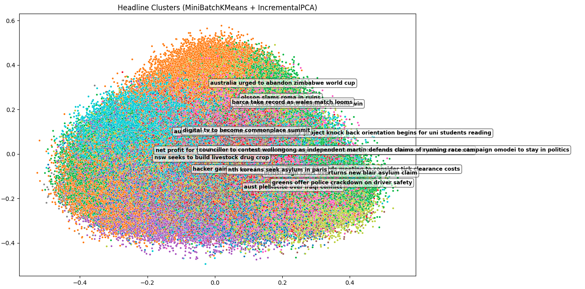

# TopicMiner - Headline Clustering & Summarization

Got it 👍
Here’s a more **theoretical-style README** (without installation/usage/project-structure details), highlighting the concepts, dataset source, and including the screenshot reference you mentioned:

---

# 📰 NewsLens – Headline Clustering & Summarization

This project explores how **unsupervised Natural Language Processing (NLP)** can be applied to organize and interpret large volumes of news data. The pipeline combines multiple AI techniques—**text preprocessing, semantic embeddings, clustering, dimensionality reduction, summarization, and keyword extraction**—to transform raw news headlines into structured insights.

---

## 🌍 Dataset

The dataset used is **[A Million News Headlines](https://www.kaggle.com/datasets/therohk/million-headlines)** from Kaggle.
It contains over **1 million news headlines** published by the Australian Broadcasting Corporation (ABC) from 2003 to 2017.

---

## 🔬 Methodology

### 1. **Preprocessing**

Headlines are cleaned using:

* Lowercasing
* Removing punctuation, numbers, and symbols
* Eliminating stopwords (common non-informative words such as *the*, *and*, *is*)
* Filtering out very short words (≤ 2 characters)

This ensures that only meaningful words are retained for further analysis.

---

### 2. **Sentence Embeddings**

Each processed headline is transformed into a **semantic vector representation** using [Sentence-BERT](https://www.sbert.net/) (`all-MiniLM-L6-v2`).
These embeddings capture **semantic similarity**—headlines with similar meanings map closer in vector space.

---

### 3. **Clustering**

The embeddings are grouped using **MiniBatchKMeans** into a fixed number of clusters (default: 50).

* Each cluster represents a **latent news topic**.
* This allows us to discover hidden structures in the dataset without supervision.

---

### 4. **Dimensionality Reduction**

To visualize the clusters, the high-dimensional embeddings (384 dimensions) are reduced to **2D** using **Incremental PCA**.

* The reduced space preserves global structure.
* Useful for plotting and human interpretation.

---

### 5. **Cluster Analysis**

For each major cluster:

* **Keywords** are extracted using **TF-IDF** (Term Frequency–Inverse Document Frequency).
* **Summaries** are generated using a lightweight **LLM summarizer** (`flan-t5-small`), producing short natural-language descriptions of the cluster themes.

This two-pronged approach (keywords + summaries) ensures interpretability.

---

### 6. **Visualization & Reporting**

The final step integrates all results:

* **Scatter plot** of clusters in 2D space, annotated with summaries at cluster centers.
* **CSV/Excel reports** listing cluster IDs, sizes, top keywords, summaries, and sample headlines.
* **Interactive HTML report** combining visualization and textual insights.

---

## 📊 Example Output

Below is a screenshot of the generated HTML report.
It shows the **cluster visualization** with summaries annotated on the plot, along with **detailed descriptions of top clusters** (keywords and sample headlines).

---

## 🎯 Key Takeaways

* **Semantic embeddings** enable grouping of news headlines beyond keyword matching.
* **Unsupervised clustering** uncovers hidden structures in large-scale text data.
* **LLM-powered summarization** provides concise human-readable explanations of clusters.
* The methodology demonstrates how AI can **transform raw news streams into structured insights** for journalism, media monitoring, and trend analysis.

---

Would you like me to also draft a **shorter academic abstract-style summary** (like for a paper or report introduction) that distills the project into 3–4 crisp paragraphs?
